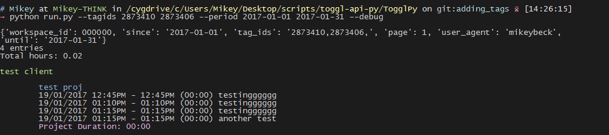

#TogglPy
TogglPy is a python library for interacting with the [Toggl API](https://github.com/toggl/toggl_api_docs).

#This fork:
Includes an example script, run.py, which you can either use as-is or as a starter for your own command line Toggl time reporting app.
Make sure to set your API key, workspace ID and user agent to the credentials.py file first.


##Output format and example output:

###Output format:
N entries   
Total hours: X   

Client Name

        Project Name
        dd/mm/yyyy hh:mmAM - hh:mmPM (HH:MM) Task
        Project Duration: HH:MM

###Example output:
3 entries    
Total hours: 2

Joe Bloggs

        JoeBloggs.com website
        10/01/2017 09:55AM - 12:10PM (02:15) Initial design of website
        Project Duration: 02:15

John Doe

        Fixing hacked JohnDoe.com website
        09/01/2017 10:00AM - 10:15AM (00:15) Recovering data
        13/01/2017 10:30AM - 10:40AM (00:10) Restoring website
        Project Duration: 00:25


## Help:
Add your API key, workspace ID, and user agent string to the `credentials.py` file.   
Then run `python run.py`.

python run.py --help
usage: run.py [-h] [--period PERIOD PERIOD] [--tagids [TAGIDS [TAGIDS ...]]]
              [--nocolors] [--debug]

This program provides some basic command line Toggl reporting.

optional arguments:
  -h, --help            show this help message and exit
  --period PERIOD PERIOD
                        Time period to report on. Usage: --period startdate
                        enddate [where startdate & enddate take the format
                        yyyy-mm-dd, e.g. 2017-05-23] (Or do not provide this
                        argument, to report on the current month)
  --tagids [TAGIDS [TAGIDS ...]]
                        Tag IDs to report on. Do not provide this argument to
                        ignore tags.
  --nocolors            Prints plain output, useful if piping to a file
  --addtags TAG         Adds tag to all returned time entries
  --removetags TAG      Removes tag from all returned time entries
  --debug               Prints debugging info


Based on Matthew Downey's TogglPy library   
(https://github.com/matthewdowney/TogglPy/).    
This script: credit (C) Mikey Beck https://mikeybeck.com.


## Example input and output:


## run.py TODO:
Better documentation

## run.py DONE:
Ability to remove tags from time entries (with --removetags parameter).    
Ability to add tags to time (with --addtags parameter).  Run without using this command first as a dry-run, then add this parameter to apply the tag to all returned time entries.     
Reporting on specific clients (with --clientids parameter)   
Make distinction between billed & unbilled time and allow reporting on either (using tags achieves this).   

## How to get client IDs for use with --clientids parameter:
Use the --getclientids parameter, e.g. ```python run.py --getclientids```   
This will print all client names and IDs.
This also adds the client names & IDs to the data.json file, enabling the use of client names (rather than just IDs) with the --clients parameter.   


## Create a tag and get its ID (this is the only way I know how to get a tag's ID at the moment):   
``curl -v -u API_TOKEN:api_token \    
    -H "Content-Type: application/json" \    
    -d '{"tag":{"name":"NEW_TAG","wid":WORKPLACE_ID}}' \    
    -X POST https://www.toggl.com/api/v8/tags``

##To get all entries without a tag:
Set `data['tag_ids']` to 0  (i.e. use `--tagids 0`)
This can be useful for finding unbilled time.  Run `python run.py --tagids 0 --addtags unbilled` to add an `unbilled` tag to all entries with no tags.


#Features
* Make requests against any (Toggl) API endpoint with request data as a dictionary
* Generate and save PDFs of summary, weekly, or detailed reports
* Fetch reports as JSON
* Get all workspaces or all clients
* Get a specific workspace or client, by id or name
* Query projects, by client, or by a single name
* Add custom time entries

#Setup
+ Download the project, or download **TogglPy.py** for local usage
+ Import the content: 
```python
from TogglPy import Toggl
```
+ Create a Toggl object: 
```python
toggl = Toggl()
```
+ Authenticate either by Toggl credentials OR using [your personal API token](https://toggl.com/app/profile):
``` python
toggl.setAuthCredentials('<EMAIL>', '<PASSWORD>') 
```
OR:
``` python
toggl.setAPIKey('<API-TOKEN>') 
```


#I learn best by examples:
###Manual GET requests against any Toggl endpoint:
```python
from TogglPy import Toggl

# create a Toggl object and set our API key 
toggl = Toggl()
toggl.setAPIKey("mytogglapikey")

response = toggl.request("https://www.toggl.com/api/v8/clients")

# print the client name and id for each client in the response
# list of returned values can be found in the Toggl docs (https://github.com/toggl/toggl_api_docs/blob/master/chapters/clients.md)
for client in reponse:
    print "Client name: %s  Client id: %s" % (client['name'], client['id'])
```
Or, if you want to add some data to your request:
```python
data = {
    'id': 42,
    'some_key': 'some_value',
    'user_agent': 'TogglPy_test',
}   
response = toggl.request("https://www.toggl.com/api/v8/some/endpoint", parameters=data)
```

###Making a POST request to any Toggl endpoint:
```python

data = { 
    "project": 
        { 
            "name": "some project", 
            "wid":777, 
            "template_id":10237, 
            "is_private":true, 
            "cid":123397 
        }
    }

response = toggl.postRequest("https://www.toggl.com/api/v8/projects", parameters=data)

```


###Generating PDF reports:
```python
# specify that we want reports from this week
data = {
    'workspace_id': 0000, # see the next example for getting a workspace id
    'since': '2015-04-27',
    'until': '2015-05-03',
}

# download one of each type of report for this time period
toggl.getWeeklyReportPDF(data, "weekly-report.pdf")
toggl.getDetailedReportPDF(data, "detailed-report.pdf")
toggl.getSummaryReportPDF(data, "summary-report.pdf")
```

###Finding workspaces and clients
This will print some raw data that will give you all the info you need to identify clients and workspaces quickly:
```python
print toggl.getWorkspaces()
print toggl.getClients()
```
If you want to clean it up a little replace those print statements with
```python
for workspace in toggl.getWorkspaces():
    print "Workspace name: %s\tWorkspace id:%s" % (workspace['name'], workspace['id'])
for client in toggl.getClients():
    print "Client name: %s\tClient id:%s" % (client['name'], client['id'])
```
If you want to find a specific client or workspace:
```python
john_doe = toggl.getClient(name="John Doe")
personal = toggl.getWorkspace(name="Personal")

print "John's client id is %s" % john_doe['id']
print "The workspace id for 'Personal' is %s" % personal['id']
```
The reverse can also be done; use `.getClient(id=0000)` or `.getWorkspace(id=000)` to find items by id.

### Starting New Timer

```python
# You can get your project pid in toggl.com->Projects->(select your project) and copying the last number of the url
myprojectpid = 10959693
toggl.startTimeEntry("my description", myprojectpid)
```

### Stopping Current Timer

```python
currentTimer = currentRunningTimeEntry()
stopTimeEntry(currentTimer['data']['id'])
```

### Creating a custom time entry

```python
# Create a custom entry for today, of a 9 hour duration, starting at 10 AM:
toggl.createTimeEntry(hourduration=9, projectname='GoogleDrive', hour=10)

# Or speed up the query process and provide the clien't name:
toggl.createTimeEntry(hourduration=9, projectname='GoogleDrive', clientname='Google', hour=10)

# Provide *month* and/or *day* too for specific dates:
toggl.createTimeEntry(hourduration=9, projectname='GoogleDrive', clientname='Google', month=1, day=31, hour=10)

# Automate missing time entries!
for day in (29, 30, 31):
    toggl.createTimeEntry(hourduration=9, projectname='someproject', day=day, hour=10)
```
    
### Automate daily records
```python
#toggle_entry.py
import datetime
if datetime.datetime.today().weekday() not in (4, 5):
    toggl.createTimeEntry(hourduration=9, projectname='someproject', hour=10)
```
#### Add your daily records as a cron job:
```shell
(crontab -l ; echo "0 22 * * * toggl_entry.py")| crontab -
```


#### Changelog:
25/01/2017: 
- Implemented --removetags parameter   
- Added credentials file (No more committing my API key)   
   
24/01/2017:   
- Added in PUT request functionality to Toggl class.
- Implemented --addtags parameter
